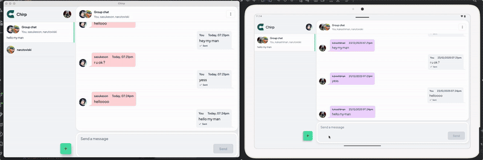
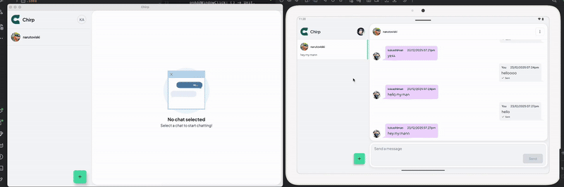
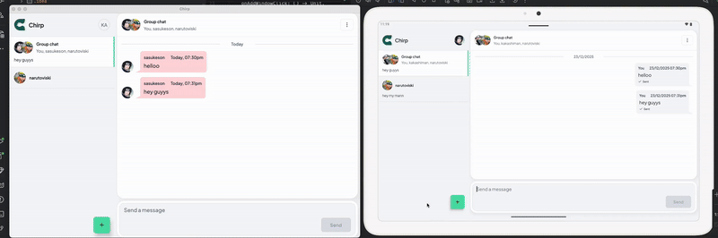
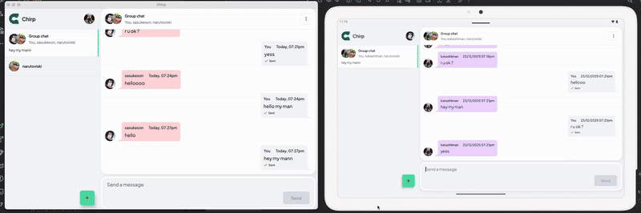

# Chirp

    
    

>Chirp is a modern chat application built with Kotlin Multiplatform, designed to provide a seamless and robust communication experience across multiple platforms. 
>Key features include:

# Project Features

*   **User Authentication:** Secure and straightforward user authentication, allowing users to easily sign up, log in, and manage their accounts.
*   **Real-time Chat:** Engage in instant conversations with real-time message delivery, ensuring users stay connected without delay.
*   **User Profile Management:** Personalize your experience by managing your user profile, including the ability to update details and potentially profile pictures.
*   **Notifications:** Stay updated with real-time notifications for new messages and important events, ensuring you never miss a beat.
*   **Offline-First Approach:** Enjoy uninterrupted access to your conversations with an offline-first pattern. Messages and data are available even without an active internet connection, syncing automatically once connectivity is restored.
*   **MVVM Architecture:** Built with the Model-View-ViewModel (MVVM) architectural pattern for a clean, maintainable, and testable codebase.
*   **Data Persistence:** Robust data persistence is achieved through:
    *   **Room:** For structured local storage of chat data and user information.
    *   **DataStore:** For storing simple key-value data, such as user preferences and authentication tokens.

# Chirp Project Tech Stack

This project is built using **Kotlin Multiplatform**, targeting **Android**, **iOS**, and **Desktop (JVM)**.

## Core Technologies:

*   **Kotlin Multiplatform:** Enables code sharing across different platforms.
*   **Jetpack Compose:** Used for building the UI on Android.
*   **Compose Multiplatform:** Extends Jetpack Compose for desktop (JVM) development.

## Architecture & Dependencies:

*   **Dependency Injection:**
    *   **Koin:** A lightweight dependency injection framework for Kotlin.
*   **Networking:**
    *   **Ktor:** A framework for creating asynchronous clients and servers in Kotlin, used here for network requests.
    *   **Kotlinx Serialization:** For handling JSON serialization and deserialization.
*   **Asynchronous Programming:**
    *   **Kotlinx Coroutines:** For asynchronous programming.
*   **Utilities:**
    *   **Kotlinx Datetime:** For handling date and time operations.
*   **AndroidX Libraries:**
    *   `core-ktx`: Core Android Kotlin extensions.
    *   `activity-compose`: For integrating Compose with Android activities.
    *   `lifecycle-runtime-ktx`, `lifecycle-viewmodel-compose`: For managing UI-related data in a lifecycle-aware manner.
    *   `datastore-preferences`: For simple key-value data storage.
*   **Databases:**
    *   **Room:** An Android Architecture Component for SQLite database access.
*   **Backend Services:**
    *   **Firebase:** Used for push notifications (Firebase Messaging).
*   **Image Loading:**
    *   **Coil:** An image loading library for Android and Compose.

## Desktop Specifics:

*   **UI Toolkit:**
    *   **Compose for Desktop:** As mentioned, used for the desktop UI.
*   **System Integration:**
    *   **jSystemThemeDetector:** For detecting system theme changes on desktop.

## Other Libraries:

*   **Logging:**
    *   **Kermit:** A multiplatform logging library.
*   **Permissions Handling:**
    *   **Moko Permissions:** For handling runtime permissions across different platforms.
*   **Adaptive UI:**
    *   **Material3 Adaptive:** For building adaptive UIs that respond to different screen sizes and configurations.
*   **Build Configuration:**
    *   **BuildKonfig:** For generating build configuration constants.

## Preview

    

## Mobile Android/Ios
<h2>Login</h2>

    
    
    
    

 
<h3>Chat</h3>

    
    
    
    
    

 
<h3>NewChat</h3>

    
    
    

 
<h3>Profile</h3>

    
    
    

 
<h2>Tablet</h2>
<h3>Tablet Android chat</h3>

## Desktop
### Desktop Mac, Linux and windows

